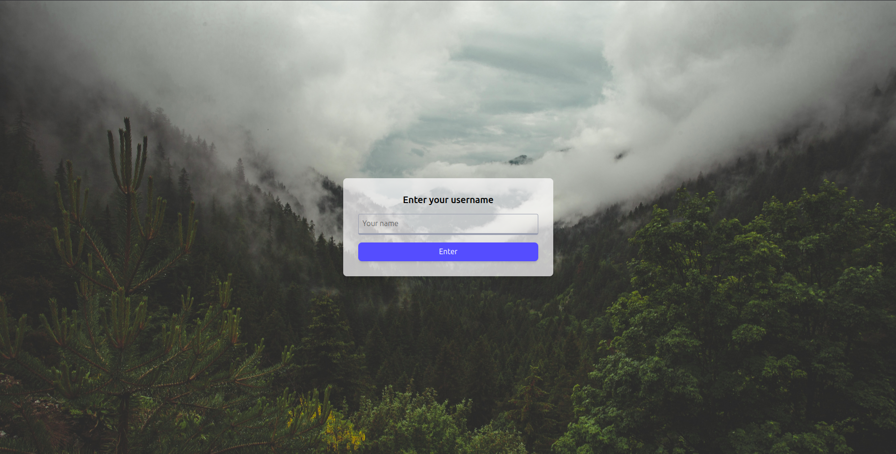
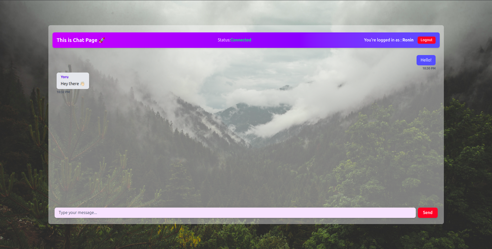

# 🗨️ Real-Time Chat App


A simple, fast, and minimal chat prototype built with **Go** on the backend and **React** on the frontend — powered by **WebSockets** for real-time messaging.

> ⚡ Easy to run with Docker on your machine.

---

##  Screenshots

### 🔹Home Screen



### 🔹Chat Screen



---

## Used

**Backend:**
- Go (Gorilla WebSocket)

**Frontend:**
- React (Vite, Tailwind)

**And:**
- WebSockets for real-time messages  
- Docker + Docker Compose for easy setup

---

## 🚀 Start Running

### Run with Docker (recommended)

```bash
docker compose up --build
